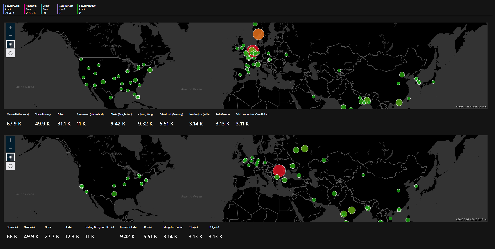
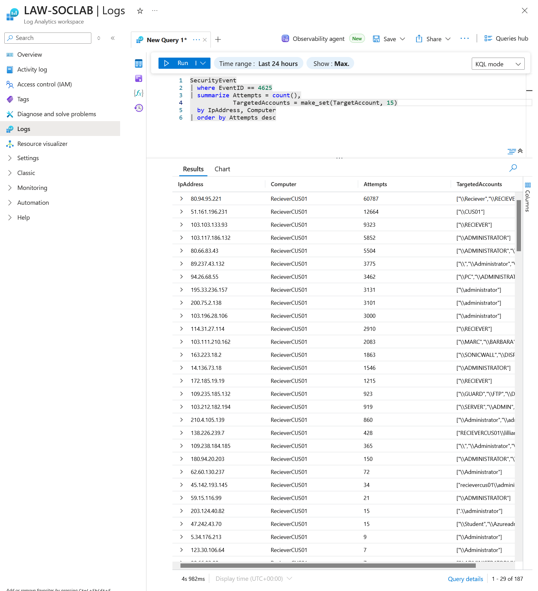
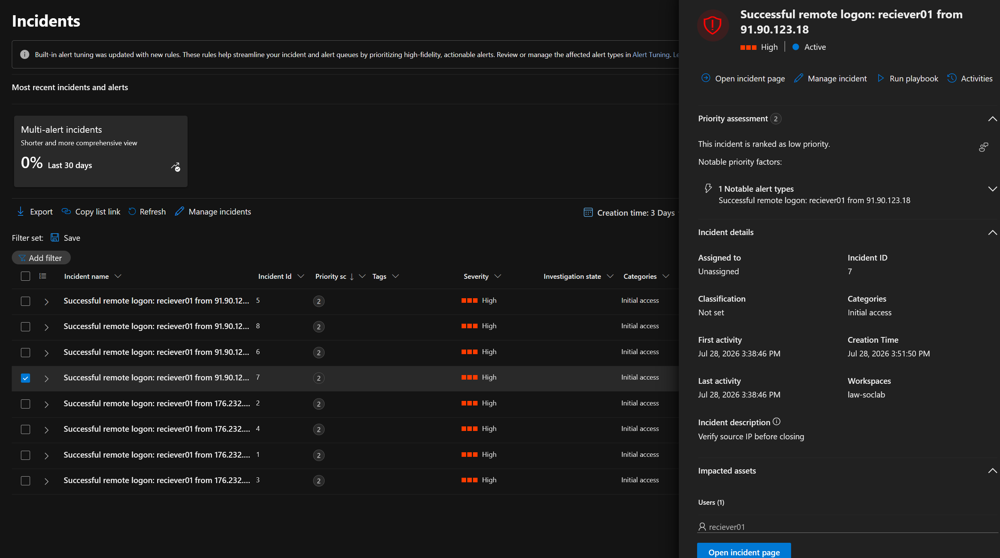

# Azure Honeypot SOC Lab

An RDP honeypot on Azure, a Sentinel detection pipeline, and an investigation that ended up
auditing its own enrichment data. What started as following a YouTube guide for an Azure lab, turned into me understanding how the lab actually worked.


---

## TL;DR

I exposed an Azure VM as an RDP honeypot and collected real world security events.

Said guide had a beautiful map that placed attacker IP's into world map but I found out that the geoip list provided was incorrect and had conflicting duplicates. I changed the watchlist with KQL's built-in `geo_info_from_ip_address()`,
verified attributions data, and built a Sentinel analytics rule to catch
any successful compromise, in-case my VM turns into a crypto-miner. All queries, tooling, and IOCs are in this repo.

**Before (Above) and After (Below) — The Watchlist:**



---

## Contents

1. [Lab architecture](#1-lab-architecture)
2. [First contact](#2-first-contact)
3. [The map lies: checking the GeoIP watchlist](#3-the-map-lies-checking-the-geoip-watchlist)
4. [The fix: native geolocation + registry verification](#4-the-fix-native-geolocation--registry-verification)
5. [Detection engineering: catching the successful logon](#5-detection-engineering-catching-the-successful-logon)
6. [Lessons](#6-lessons)
7. [IOC appendix](#7-ioc-appendix)

---

## 1. Lab architecture

Everything runs in a single resource group on an Azure free trial.
You don't need a budget to practice detection engineering. (Though rnicrosoft requires a credit card information for setting a free account)


The pipeline:

```
Windows VM (RecieverCUS01, disabled firewall)
        │
        ▼
Azure Monitor Agent  ──(Data Collection Rule: Security Events)──►  Log Analytics Workspace (LAW-SOCLAB)
        │
        ▼
Microsoft Sentinel  ─────────► KQL Analysis, Workbooks, Watchlists, Analytics Rules
```

The deliberate misconfiguration that generates the entire dataset: the NSG inbound rule allows
TCP 3389 from `Any`, and the Windows host firewall is disabled. This is the "I'll just open RDP
real quick" mistake, made on purpose and contained — the VM is isolated in its own resource
group and VNet, holds nothing of value, and uses a strong unique local password so the honeypot
stays a honeypot.

## 2. First contact

It did not take minutes before brute-force attacks begun. Azure's public IP ranges are
published and continuously scanned; a fresh RDP endpoint enters attacker target lists almost
immediately — and recycled Azure IPs may already be on them before you even boot.

Within ~24 hours of soaking, the workspace logged **120,284 failed logons** (Windows EventID
4625) from **190 unique attacker IPs** — an average of one brute-force attempt every
0.7 seconds, around the clock.



## 3. The map lies: checking the GeoIP watchlist

The lab guide this project started from enriches attacker IPs using a ~54,000-row GeoIP list
imported as a Sentinel watchlist. The resulting map looked plausible.
Top attackers were Amstelveen and Maarn, Netherlands — Europe's hosting hub, believable. I almost
published that finding.

Two absences bothered me. I expected my own failed logins from Istanbul to appear — they didn't
(for a good reason: my logins were *successful* 4624s, and the map only plots failures 4625. That was my bad).

More importantly there was **no Russia anywhere on an RDP honeypot map**, which anyone
who knows cybersecurity would find weird. The hunch triggered the right prompt.

Thus I've asked Claude if it could check the GeoIP list that I've got. Turns out it was a bit outdated.


## 4. The fix: native geolocation + registry verification

I've learned that Log Analytics has a built-in, Microsoft-maintained geolocation function that could replace the entire
watchlist mechanism:

```kusto
SecurityEvent
| where EventID == 4625
| summarize FailureCount = count() by IpAddress
| extend geo = geo_info_from_ip_address(IpAddress)
| extend city = tostring(geo.city), country = tostring(geo.country),
         latitude = toreal(geo.latitude), longitude = toreal(geo.longitude)
| project FailureCount, AttackerIp = IpAddress, latitude, longitude, city, country,
          friendly_location = strcat(city, " (", country, ")")
```

(Claude pointed out that summarizing *before* the geo lookup also means one enrichment

per unique IP instead of per event, which is cheaper and faster than the original per-event join.)


Russia, absent from the old map entirely, lights up on the corrected one.

**Verification layer.** MaxMind-backed geolocation is current, but attribution in a published
writeup deserves a second, independent source. So far i haven't done that


## 5. Detection engineering: catching the successful logon

A honeypot with the firewall off will eventually be compromised, that's the design of the lab.

The signal that if it happens is a *successful* logon (EventID 4624) from an external IP. That's the moment the
honeypot stops being my lab and starts being someone else's crypto-miner. So I made a scheduled Sentinel
analytics rule watches for that:

```kusto
SecurityEvent
| where EventID == 4624
| where LogonType in (3, 10)
| where IpAddress !in ("-", "127.0.0.1", "::1")
| where AccountType == "User"
| where TargetUserName !endswith "$"
| where TargetUserName != "ANONYMOUS LOGON"
| project TimeGenerated, TargetUserName, IpAddress, LogonType, LogonProcessName, WorkstationName
```

Filter rationale: LogonType 10 = RemoteInteractive (RDP), 3 = Network; machine-local logons and
computer accounts (`$` suffix) are noise; `ANONYMOUS LOGON` is excluded because exposed SMB
(port 445) completes benign anonymous NTLM sessions that would otherwise fire the rule
constantly — the classic false positive of 4624-based detections.

Rule configuration: runs every 5 minutes over a 10-minute lookback (overlap beats gaps in my opinion, safe and not sorry),
severity High, MITRE ATT&CK Initial Access (T1078 Valid Accounts), **entity mapping** of
`IpAddress` → IP and `TargetUserName` → Account (which enables entity pages and the
investigation graph), and a dynamic alert name:
`Successful remote logon: {{TargetUserName}} from {{IpAddress}}`.

I did **not** exclude my own IP from the rule. Every one of my own RDP sessions
fires an incident, which I then triage and close as *Benign Positive* (Also for Linked-in).
That trades alert fidelity for continuous end-to-end validation of the pipeline — and for triage
practice. The known risk of this model is autopilot: closing your own alerts without looking is
exactly how real SOCs miss real intrusions hiding in expected noise. The mitigation is checking
the IP field every time, and switching back to a high-fidelity exclusion if triage starts
feeling like a chore.



## 6. Lessons

**Enrichment data is an attack surface for your conclusions.** Nothing was wrong with my events,
my queries, or my map rendering. The problem was just a reference CSV I'd easily skip to
question. Stale enrichment doesn't fail loudly; it fails plausibly, which is worse.

**Absence of expected signal is itself a detection.** "No Russia on an RDP honeypot map" is what
triggered my journey. Knowing what the data *should* look like is as important as reading what it
does look like.

**If any one is still reading,** that IP is not a mistake, I was eating virtual chocolate on one day, virtual kebab on the other.

## 7. IOC appendix

Top failed-logon sources observed over the honeypot's full exposure, 27–29 July 2026:
**205 unique IPs and 196,773 attempts** in ~44.5 hours of soaking — an average of one
brute-force attempt every **0.8 seconds** from first event to last. Full query data is
included in the repo.

|IP|Attempts|Accounts tried|Behavior|GeoIP location|
|-|-|-|-|-|
|80.94.95.221|60,787|2|Dictionary, ~370/5min sustained for ~14 hours — **31% of the entire dataset alone**|Romania|
|51.161.196.231|49,861|4|Flood attacker: repeated high-rate bursts across a 14-hour window, including one measured burst of **12,664 attempts in 4.4 minutes** (~14,400/5min)|Australia|
|82.208.111.94|11,004|1|Fast dictionary, ~2.8h — the **first attacker of the entire run**, arriving the moment the VM went live|Nizhniy Novgorod, Russia|
|103.117.186.132|9,423|1|Low-rate continuous, **38.3h — longest-running attacker observed**|Bhiwandi, India|
|103.103.133.93|9,323|1|Slow dictionary, ~18h run|India|
|80.94.95.83|7,134|7|Multi-account dictionary, ~4.3h — **same /24 as the top attacker** (80.94.95.0/24)|Romania|
|80.66.83.43|5,504|2|Steady dictionary, ~8.6h|Russia|
|89.237.43.132|3,775|11|Fast multi-account run, ~1.1h|Novotroitsk, Russia|
|94.26.68.55|3,463|5|Intermittent, low-and-slow across ~26h — second-longest presence observed|Bulgaria|
|195.33.236.157|3,131|1|Single-account burst, ~250/5min for 1 hour|Türkiye|
|103.111.210.162|2,147|176|Username spray — see botnet note below|Indonesia|
|163.223.18.2|1,933|176|Username spray — see botnet note below|Afghanistan|
|109.235.185.132|965|176|Username spray — see botnet note below|Sochi, Russia|
|138.226.239.7|545|401|Widest spray observed: 401 distinct usernames in ~9h|United Kingdom|

**Botnet note:** three IPs on three continents (Indonesia, Afghanistan, Russia) each tried
exactly **176 usernames**, started within minutes of each other (09:32–09:40 UTC, 28 July),
and ran for ~8 hours each. Same wordlist, same schedule, different exit nodes.

**Coordinated infrastructure note:** two of the top six attackers (80.94.95.221 and
80.94.95.83) come from the same Romanian /24 — likely the same operator running separate
campaigns from adjacent addresses.

Of the 205 source IPs, **104 sent just one probe**, probably are scanners cataloguing the endpoint
rather than attacking it. The other 101 did the brute-forcing.

A note on the window: the collection query covered 7 days, but the VM's entire exposed
lifetime was ~44.5 hours (27 July 15:20 UTC → 29 July 11:52 UTC). The 24-hour snapshot in
section 2 is a subset of this data — and comparing the two windows revealed something the
snapshot alone hid: the Australian flood attacker (51.161.196.231) looked like a
one-off 4-minute burst in the 24h view, but the full run shows it returned repeatedly,
racking up nearly 50,000 attempts. Window size changes conclusions.

Usernames attempted include: `ADMINISTRATOR`, `ADMINISTRADOR`, `ADMIN`, `USER`, `SYSTEM`,
`BACKUP` — plus the spray bots' 176–401-name wordlists targeting localized and
service-account naming schemes.

---

## Credits & ethics

Lab foundation: [Josh Madakor's SOC honeypot project](https://youtu.be/g5JL2RIbThM?si=Wj325AUVo3y5eqUe) —
extended here with the watchlist edit, the native-geolocation rework, and the detection rule.

The honeypot is an isolated, disposable VM containing no real
data; attacker IPs are published as standard defensive IOC sharing. My own identifiers are
redacted from screenshots.

Remember to turn off your VM after lab is concluded if you try the same lab. As Josh also repeatedly warns.

*Built as part of my SOC analyst portfolio. Feedback and questions are welcome.*

